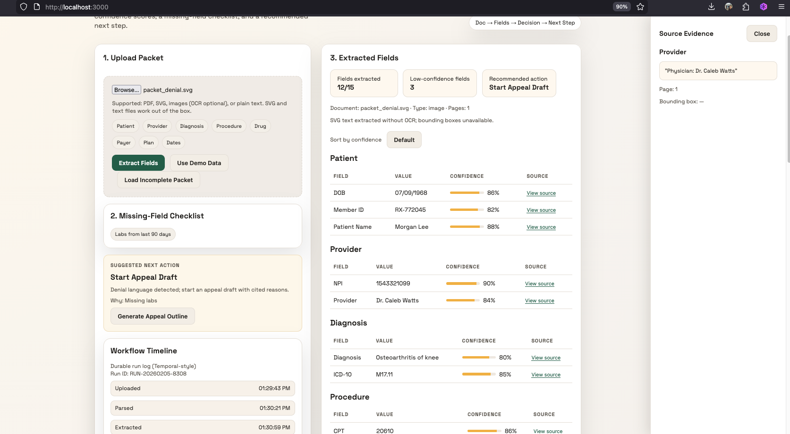
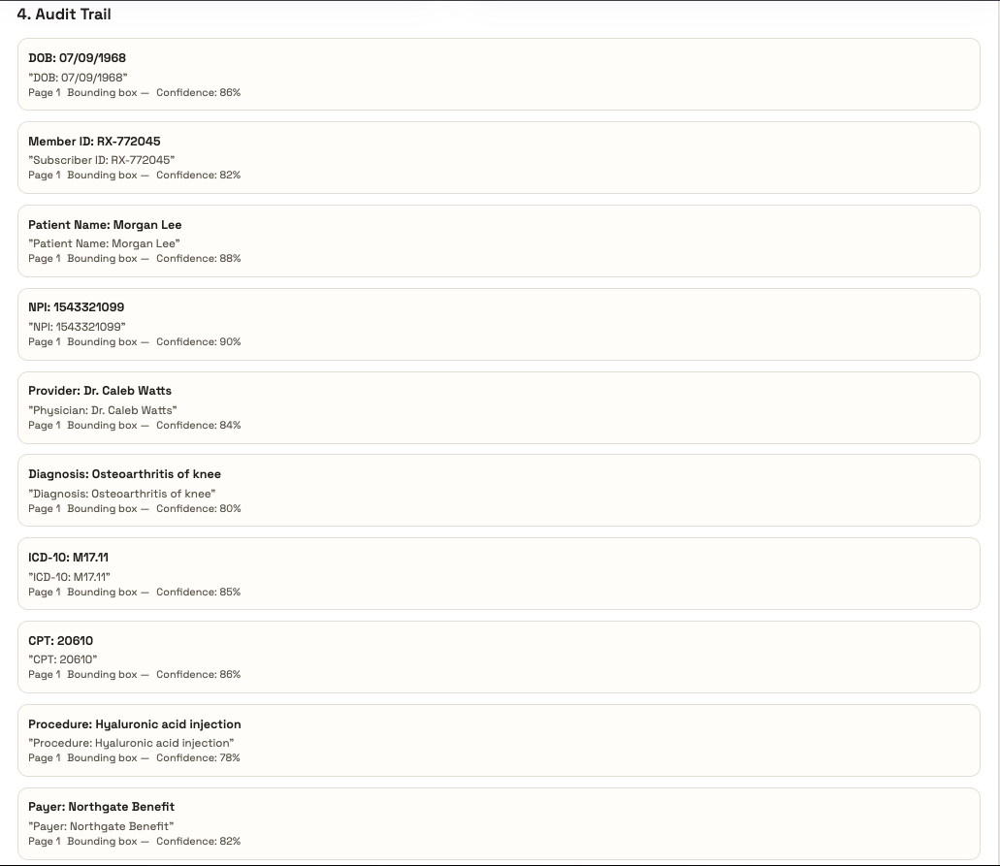
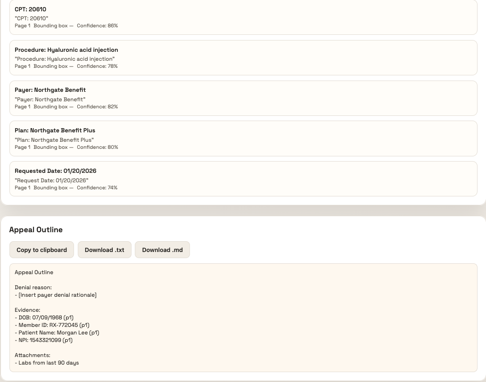

# Prior Auth Packet Extractor

Extracts structured prior-authorization fields from messy packets with confidence scores, missing-field checklist, and auditable source traces.

## What It Does
- Ingests prior auth packets (PDF, SVG, image, or text)
- Extracts key fields for patient, provider, diagnosis, procedure, drug, payer, plan, and dates
- Assigns confidence scores and flags low-confidence or missing values
- Produces a missing-field checklist and a recommended next action
- Generates a source trace with page, snippet, and bounding box when available
- Supports appeal drafting with a structured outline you can copy/export

## Product Screens

### Source Evidence Drawer


### Audit Trail With Confidence


### Appeal Outline Export


## Architecture
- `web/` Next.js app (upload + results UI)
- `api/` FastAPI service (file parsing + extraction)
- `sample_docs/` synthetic packets (SVGs you can upload as-is)

## Quickstart

### Backend
```bash
cd api
python3 -m venv .venv
source .venv/bin/activate
pip install -r requirements.txt
uvicorn main:app --reload --port 8000
```

### Frontend
```bash
cd web
npm install
npm run dev
```

Open `http://localhost:3000`.

The UI defaults to `http://localhost:8000` for the API. Override with:
```bash
export NEXT_PUBLIC_API_URL="http://127.0.0.1:8000"
```

## Sample Documents
Upload any of these from `sample_docs/`:
- `sample_docs/packet_complete.svg`
- `sample_docs/packet_missing.svg`
- `sample_docs/packet_denial.svg`

SVGs are parsed without OCR. For scanned images, install OCR dependencies.

## OCR (Optional)
The API supports OCR for image files if you install:
- `pillow`
- `pytesseract`

You will also need the Tesseract binary on your system.

## API Response Shape
The `/extract` endpoint returns:
- `document` metadata and warnings
- `fields` array with `section`, `key`, `label`, `value`, `confidence`, `source`
- `missing_fields` checklist
- `suggested_next_action` with `action` + `reason`
- `audit_trail` with snippet, page, and bounding box

## How It Works
1. Parse document text and layout (pdfplumber or OCR fallback)
2. Apply rules-based extraction for labeled fields
3. Heuristic extraction for codes (ICD-10, CPT, NDC)
4. Validate required fields and supporting documents
5. Recommend next step and generate audit trail

## EHR + Workflow Automation
- Map extracted fields to EHR prior-auth records
- Use confidence thresholds to route low-confidence fields for review
- Missing-field checklist triggers collection tasks
- Suggested action feeds workflow orchestration
- Source traces provide auditability for payer disputes

## Notes On Hybrid Extraction
This MVP uses deterministic rules and pattern matching for speed and auditability. The extractor is structured so you can add an LLM pass for messy free-text sections, then attach LLM-backed snippets to the audit trail.

## License
MIT. See `LICENSE`.
